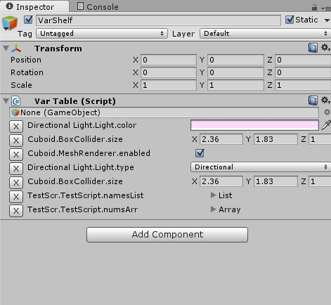

VarTable Unity Editor Script
============================
Control multiple variables in a single panel.

How to:
 1. Add a VarTable script to an empty object in the scene.
 2. Select an object (in the scene or a prefab), a component, and a field name.
 3. Modify the value.
 
 
 
The modifications show up in real time to the affected variable.  It works for properties (assuming they act like an interface to a field) and fields.

Currently only supports public fields/properties.
 
TODO:
 * Undo support, avoid MarkAllScenesDirty
 * Option to organise by object
 * Easier way to add variables
 * Variable rename/refactor?
 * Less hacky way to do toggle sections